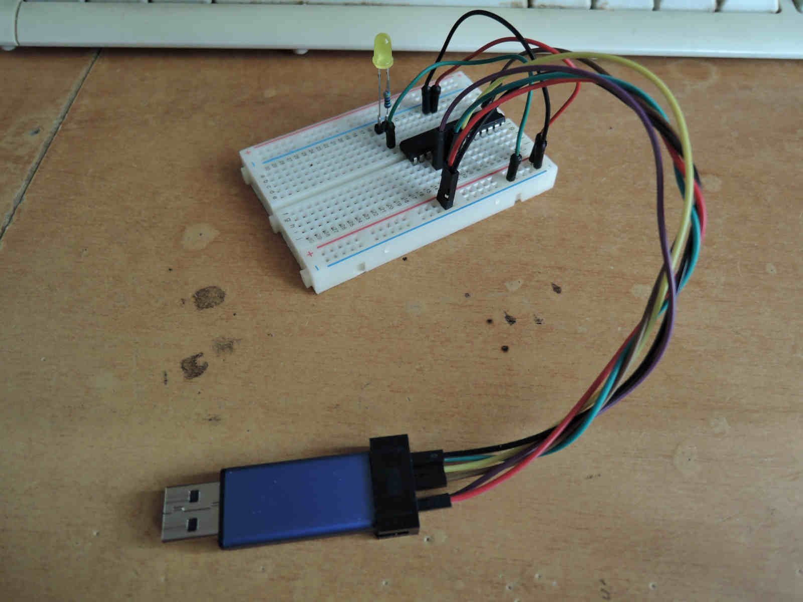

# blink
You probably know that "blink" for mc people means the same as "Hello world!" for others. 

blink.c - my attempt to use atmega8 avr-gcc and c language to blink a led. 
blink.S - my attempt to use atmega8 avr-gcc and assembly to blink. 
Makefile - to do my work more easily. 

If you prefer a console commands: 

C source: 

avr-gcc -Wall -Os -mmcu=atmega8 -DF_CPU=4000000L -o blink blink.c 
avr-objcopy -O ihex blink blink.hex 
avrdude -c usbasp -p m8 -B 1 -U flash:w:blink.hex 

Assembly source: 

avr-gcc -Os -Wall -mmcu=atmega8 blink.S -o blink 
avr-objcopy -O ihex blink blink.hex 
avrdude -p atmega8 -c usbasp -B 1 -U flash:w:blink.hex 

So that's it. 

